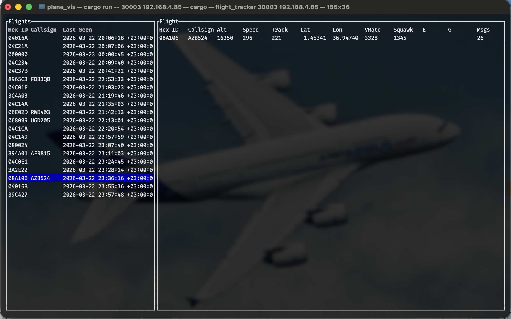

# icaRS (Icarus)
This program reads a tcp steam of [SSB1](http://woodair.net/sbs/article/barebones42_socket_data.htm) messages and displays them in a text user interface.



## Setup
- A SRD apparatus, perhaps a [RTL-SDR](https://www.rtl-sdr.com/)
- A SSB1 stream, perhaps from [dump1090](https://github.com/MalcolmRobb/dump1090)

## Usage

```
$ ./icarRS <port> <ip>
```

## Features
- Fetch flight information from hexdb.io to enhance SSB1 data

